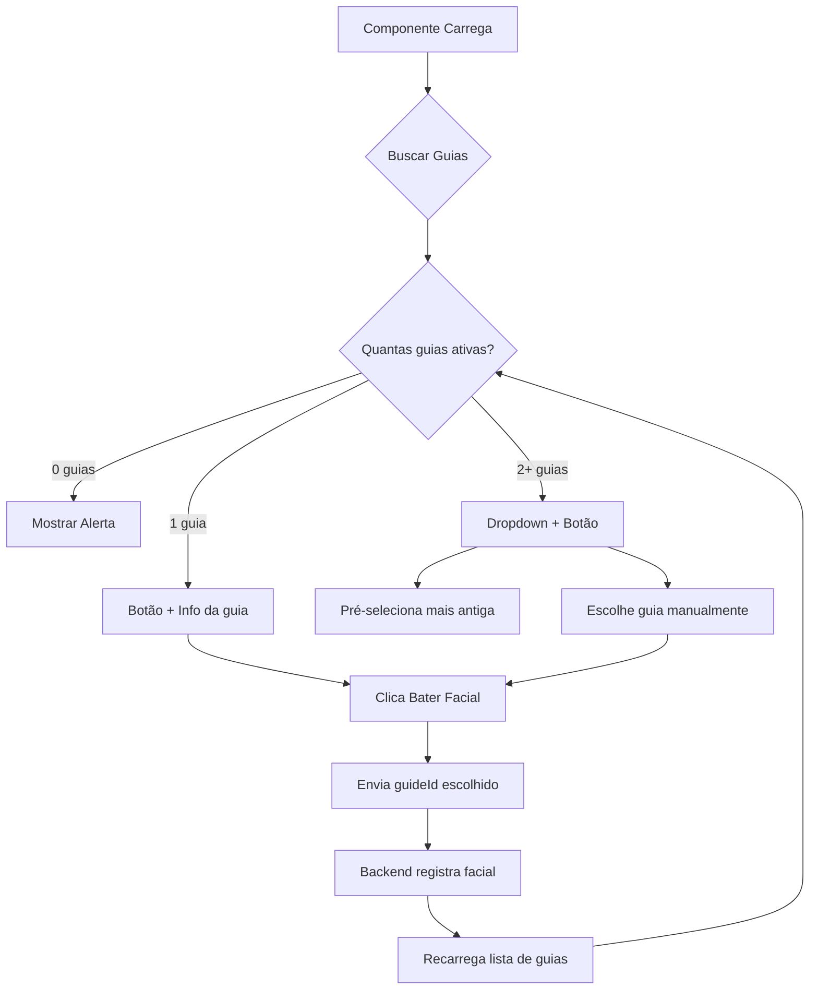

# Escolha de Guia no Registro de Facial

## 📋 Funcionalidade

Quando um paciente possui **mais de uma guia ativa** com créditos disponíveis, ele agora pode **escolher manualmente** qual guia usar para registrar a facial.

## 🎯 Comportamento

### Cenário 1: Uma Guia Ativa

**Comportamento:**
- Mostra apenas o botão "Bater Facial"
- Usa automaticamente a única guia disponível
- Exibe: "+1 crédito no saldo • Guia #123456"

### Cenário 2: Múltiplas Guias Ativas

**Comportamento:**
- Mostra dropdown de seleção de guia
- **Pré-seleciona a guia mais antiga** (FIFO - First In, First Out)
- Primeira guia na lista tem ⭐ indicando que é a padrão
- Paciente pode escolher outra guia manualmente
- Exibe: "+1 crédito no saldo • Usando guia selecionada"

### Cenário 3: Nenhuma Guia Ativa

**Comportamento:**
- Exibe alerta: "Nenhuma guia ativa disponível. Adicione uma guia para registrar faciais."
- Botão de facial não aparece

## 🔧 Implementação

### Componente: `components/patient/facial-registration.tsx`

**Funcionalidades adicionadas:**

1. **Busca de Guias Ativas:**
   ```typescript
   - Busca todas as guias do paciente
   - Filtra guias com créditos disponíveis
   - Filtra guias não expiradas
   - Ordena por data de criação (mais antiga primeiro)
   ```

2. **Seleção Inteligente:**
   ```typescript
   - Se 1 guia: usa automaticamente
   - Se 2+ guias: mostra dropdown com pré-seleção da mais antiga
   - Se 0 guias: mostra alerta
   ```

3. **Interface:**
   - Dropdown compacto (altura reduzida)
   - Label explicativo: "Escolha a guia (padrão: mais antiga)"
   - Cada opção mostra:
     - ⭐ na primeira guia (padrão FIFO)
     - Número da guia
     - Nome da empresa
     - Créditos disponíveis

## 📊 Exemplos de Interface

### Exemplo 1: Dropdown de Seleção

```
┌─────────────────────────────────────────┐
│ Escolha a guia (padrão: mais antiga)    │
├─────────────────────────────────────────┤
│ ⭐ Guia #123 - Unimed (7 disponíveis) ▼ │
└─────────────────────────────────────────┘

Opções no dropdown:
⭐ Guia #123 - Unimed (7 disponíveis)
   Guia #456 - Amil (4 disponíveis)
   Guia #789 - Bradesco (8 disponíveis)
```

### Exemplo 2: Botão e Info

```
┌─────────────────────┐
│  Bater Facial       │
└─────────────────────┘
+1 crédito no saldo • Usando guia selecionada
```

## 🎨 Detalhes de UX

### Estados do Componente

1. **Loading (Buscando guias):**
   ```
   ┌─────────────────────┐
   │ Carregando guias... │ [disabled]
   └─────────────────────┘
   ```

2. **Uma guia disponível:**
   ```
   ┌─────────────────────┐
   │  Bater Facial       │
   └─────────────────────┘
   +1 crédito no saldo • Guia #123456
   ```

3. **Múltiplas guias:**
   ```
   Escolha a guia (padrão: mais antiga)
   ┌─────────────────────────────────┐
   │ ⭐ Guia #123 - Unimed (7...)  ▼ │
   └─────────────────────────────────┘
   
   ┌─────────────────────┐
   │  Bater Facial       │
   └─────────────────────┘
   +1 crédito no saldo • Usando guia selecionada
   ```

4. **Nenhuma guia:**
   ```
   ┌─────────────────────────────────────────┐
   │ ℹ️ Nenhuma guia ativa disponível.       │
   │    Adicione uma guia para registrar     │
   │    faciais.                              │
   └─────────────────────────────────────────┘
   ```

## 🔄 Fluxo de Uso



## 🎯 Benefícios

1. **Flexibilidade:** Paciente pode escolher qual guia usar
2. **FIFO por padrão:** Sistema sugere a guia mais antiga
3. **UX Limpa:** Só mostra dropdown quando necessário
4. **Informativo:** Mostra créditos disponíveis de cada guia
5. **Feedback claro:** Indica qual guia está sendo usada

## 🔧 API Backend

O backend (`/api/facials`) já suportava o parâmetro opcional `guideId`:

```typescript
// Antes (automático):
POST /api/facials
{}

// Agora (com escolha):
POST /api/facials
{
  "guideId": "guide_id_here"
}
```

**Nenhuma mudança necessária no backend!** ✓

## ✅ Validações Mantidas

1. ✓ Só guias com créditos disponíveis
2. ✓ Só guias não expiradas
3. ✓ Só guias com status ACTIVE
4. ✓ Aviso se já fez facial no dia
5. ✓ Atualização automática após registro

## 📝 Notas Técnicas

- **Re-fetch:** Após registrar facial, busca guias novamente para atualizar lista
- **Ordenação:** `createdAt ASC` garante FIFO
- **Pré-seleção:** Primeira guia do array ordenado
- **Indicador visual:** ⭐ mostra qual é a guia padrão
- **Responsivo:** Funciona bem em mobile e desktop

---

**Implementado em:** 2025-01-06  
**Componente:** `components/patient/facial-registration.tsx`

