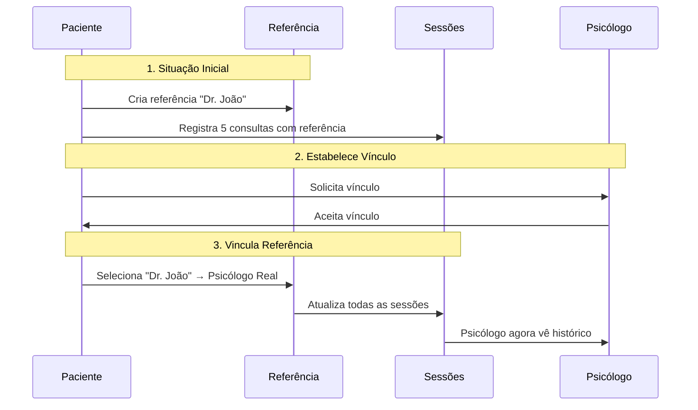

# Vinculação de Referências a Psicólogos Reais

## Problema Resolvido

Quando um paciente registra consultas antes de estabelecer vínculo com um psicólogo, ele cria "referências" (nomes genéricos de psicólogos). Depois que o vínculo é estabelecido, é necessário associar essas referências aos psicólogos reais para manter o histórico organizado.

## Como Funciona

### 1. Cenário de Uso

**Situação Inicial:**
- Paciente cria referência "Dr. João Silva" e registra 5 consultas
- Posteriormente, o "Dr. João Silva" real se cadastra no sistema
- Paciente e psicólogo estabelecem vínculo

**Problema:**
- As consultas antigas estão vinculadas apenas à referência
- O psicólogo real não tem acesso ao histórico completo

**Solução:**
- Paciente vincula a referência ao psicólogo real
- Todas as consultas são automaticamente atualizadas
- Psicólogo agora vê todo o histórico

### 2. Interface do Paciente

**Localização:** Dashboard do Paciente → Aba "Referências"

**Funcionalidades:**

1. **Visualizar Referências Não Vinculadas**
   - Lista todas as referências sem vínculo
   - Mostra quantidade de consultas de cada referência
   - Opção de vincular a psicólogos aceitos

2. **Vincular Referência**
   - Selecionar psicólogo da lista de vínculos aceitos
   - Botão "Vincular Referência"
   - Confirmação de sucesso

3. **Visualizar Referências Vinculadas**
   - Lista referências já vinculadas
   - Mostra psicólogo associado
   - Opção de desvincular

### 3. API Endpoints

#### `PUT /api/references/{id}/link`

Vincula uma referência a um psicólogo real.

**Request:**
```json
{
  "psychologistId": "psych_id"
}
```

**Validações:**
- Referência deve pertencer ao paciente logado
- Referência não pode já estar vinculada
- Psicólogo deve existir
- Deve existir vínculo ACEITO entre paciente e psicólogo
- Não pode haver outra referência vinculada ao mesmo psicólogo

**Response (200):**
```json
{
  "id": "ref_id",
  "name": "Dr. João Silva",
  "linkedPsychologist": {
    "id": "psych_id",
    "user": {
      "name": "Dr. João Silva",
      "email": "joao@example.com"
    }
  },
  "message": "Referência vinculada com sucesso! As consultas anteriores foram atualizadas."
}
```

**Efeitos Colaterais:**
- Atualiza `linkedPsychologistId` na referência
- Atualiza `psychologistId` em todas as sessões que usam essa referência

#### `DELETE /api/references/{id}/link`

Remove o vínculo de uma referência.

**Efeitos:**
- Remove `linkedPsychologistId` da referência
- Remove `psychologistId` das sessões (mantém apenas a referência)

### 4. Regras de Negócio

1. **Pré-requisitos para Vincular:**
   - Referência deve existir
   - Referência deve pertencer ao paciente
   - Referência não pode já estar vinculada
   - Deve existir vínculo ACEITO com o psicólogo

2. **Unicidade:**
   - Um paciente pode ter apenas UMA referência vinculada por psicólogo
   - Evita duplicação e confusão no histórico

3. **Atualização Automática:**
   - Ao vincular: todas as sessões com `psychologistReferenceId` recebem `psychologistId`
   - Ao desvincular: `psychologistId` é removido das sessões

4. **Histórico Preservado:**
   - Consultas antigas são mantidas
   - Apenas o vínculo é atualizado
   - Psicólogo passa a ter acesso ao histórico completo

### 5. Fluxo Completo



### 6. Benefícios

✅ **Para o Paciente:**
- Organiza histórico de consultas
- Mantém registros consistentes
- Facilita acompanhamento

✅ **Para o Psicólogo:**
- Acesso ao histórico completo do paciente
- Visão de todas as consultas, mesmo anteriores ao vínculo
- Melhor continuidade do tratamento

✅ **Para o Sistema:**
- Dados organizados e consistentes
- Relacionamentos claros
- Auditoria facilitada

### 7. Exemplo Prático

**Antes:**
```
Paciente: João
├─ Referência: "Dra. Maria Santos"
│  └─ Sessões: [S1, S2, S3, S4, S5]
└─ Vínculo: Dra. Maria Santos (ACEITO)
   └─ Sessões: []
```

**Ação:** Vincular referência ao psicólogo real

**Depois:**
```
Paciente: João
├─ Referência: "Dra. Maria Santos" → Dra. Maria Santos (real)
└─ Vínculo: Dra. Maria Santos (ACEITO)
   └─ Sessões: [S1, S2, S3, S4, S5] ← Todas atualizadas!
```

### 8. Mensagens ao Usuário

**Sucesso:**
- "Referência vinculada com sucesso! As consultas anteriores foram atualizadas."

**Erros:**
- "Esta referência já está vinculada a um psicólogo"
- "Você precisa ter um vínculo aceito com este psicólogo antes de vincular a referência"
- "Você já tem outra referência vinculada a este psicólogo"
- "Esta referência não pertence a você"

## Arquivos Envolvidos

- `app/api/references/[id]/link/route.ts` - API
- `components/patient/references-manager.tsx` - Interface
- `app/dashboard/patient/page.tsx` - Integração
- `middleware.ts` - Proteção de rota

